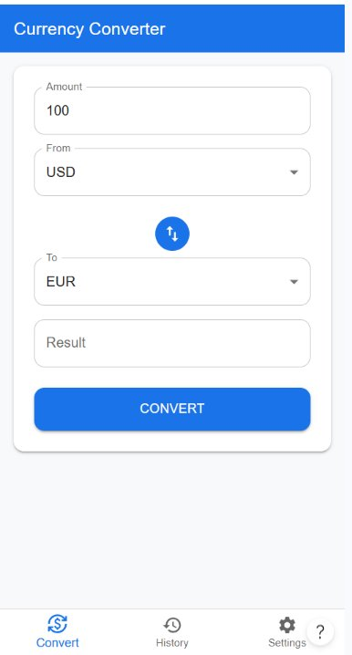
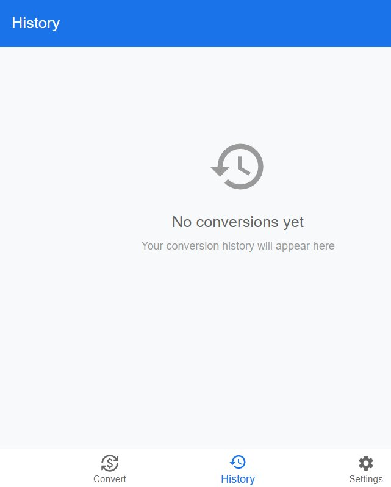
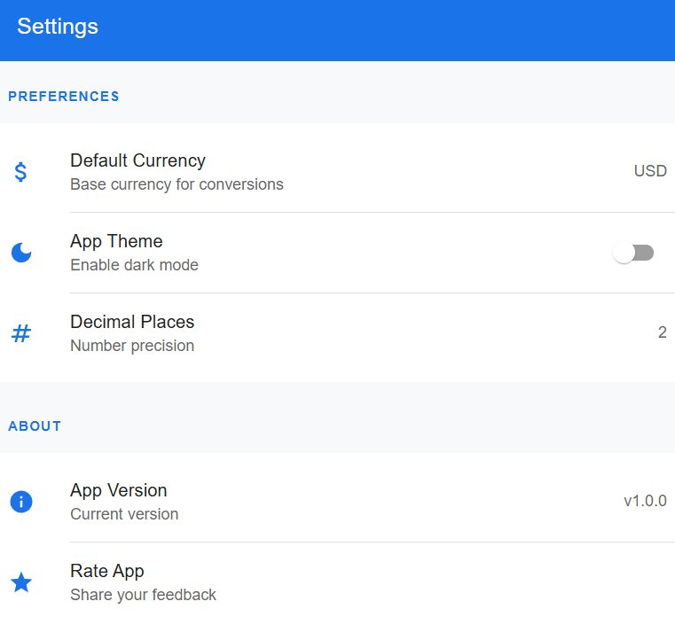

# Convertidor de Monedas


Aplicación móvil Android que permite convertir monedas en tiempo real, diseñada para turistas, viajeros frecuentes y estudiantes que viven fuera de su país.

---

## Descripción del Problema

Cuando una persona viaja a otro país o vive en el extranjero, necesita conocer el valor real de su dinero antes de realizar compras, pagar servicios o administrar su presupuesto diario. Consultar tasas de cambio manualmente o depender de páginas web poco intuitivas genera confusión y pérdida de tiempo en momentos clave.

**Convertidor de Monedas** resuelve este problema ofreciendo una herramienta rápida, intuitiva y sin registro que permite convertir entre monedas con tasas actualizadas en tiempo real, directamente desde el celular.

---

## Objetivo de la Aplicación

Proporcionar a turistas, viajeros frecuentes y estudiantes internacionales una herramienta móvil simple y confiable para convertir monedas en tiempo real, con historial de conversiones y funcionamiento offline mediante caché local.

---

## Historias de Usuario del MVP

| ID | Título | Como... | Quiero... | Para... |
|---|---|---|---|---|
| HU-01 | Conversión para compras | Turista extranjero | Convertir mi moneda natal a la moneda local antes de comprar | Conocer el costo real y evitar confusiones con el tipo de cambio |
| HU-02 | Selección de monedas | Usuario de la aplicación | Seleccionar fácilmente la moneda de origen y destino desde una lista | Realizar conversiones rápidas y sin errores |
| HU-03 | Tasas en tiempo real | Viajero frecuente | Consultar tasas de cambio actualizadas en tiempo real | Obtener conversiones precisas mientras viajo entre países |
| HU-04 | Conversión para gastos estudiantiles | Estudiante extranjero | Convertir mi dinero a la moneda del país donde estudio | Administrar correctamente mis gastos diarios y presupuesto |
| HU-05 | Historial de conversiones | Viajero | Guardar el historial de mis últimas conversiones | Revisar valores anteriores sin ingresar nuevamente los datos |

---

## Capturas de Pantalla

<p align="center">
  
  &nbsp;&nbsp;
  
  &nbsp;&nbsp;
  
</p>
<p align="center">
  <em>ConvertScreen &nbsp;&nbsp;&nbsp;&nbsp;&nbsp;&nbsp;&nbsp;&nbsp;&nbsp;&nbsp;&nbsp; HistoryScreen &nbsp;&nbsp;&nbsp;&nbsp;&nbsp;&nbsp;&nbsp;&nbsp;&nbsp;&nbsp;&nbsp; SettingsScreen</em>
</p>

---

## Arquitectura

El proyecto implementa **MVVM + Clean Architecture** con separación en 3 capas:

```
┌─────────────────────────────────────┐
│        CAPA DE PRESENTACIÓN (UI)    │
│  ConvertScreen · HistoryScreen      │
│  SettingsScreen · ConversionViewModel│
└──────────────────┬──────────────────┘
                   │
┌──────────────────▼──────────────────┐
│      CAPA DE LÓGICA DE NEGOCIO      │
│  ConvertCurrencyUseCase             │
│  ValidateAmountUseCase              │
│  GetExchangeRateUseCase             │
│  SaveConversionUseCase              │
└──────────────────┬──────────────────┘
                   │
┌──────────────────▼──────────────────┐
│          CAPA DE DATOS              │
│  CurrencyRepository                 │
│  ExchangeRateApiService (Retrofit)  │
│  ExchangeRateDao (Room DB)          │
│  ConversionHistoryDao (Room DB)     │
└─────────────────────────────────────┘
```

### Entidades principales

| Entidad | Almacenamiento | Descripción |
|---|---|---|
| `Moneda` | Room DB | Lista de monedas disponibles |
| `TasaDeCambio` | Room DB + API | Tasas actualizadas con caché local |
| `HistorialConversion` | Room DB | Registro de conversiones realizadas |
| `PreferenciaUsuario` | SharedPreferences | Configuración y moneda favorita |

---

## Tecnología Usada

| Componente | Tecnología |
|---|---|
| Lenguaje | Kotlin |
| UI | Jetpack Compose |
| Arquitectura | MVVM + Clean Architecture |
| Base de datos local | Room DB |
| Consumo de API | Retrofit |
| Navegación | Navigation Component |
| Control de versiones | Git + GitHub |
| IDE | Android Studio |

---

## Instalación y Configuración

### Requisitos previos

- Android Studio Hedgehog o superior
- JDK 17 o superior
- Android SDK 24 o superior (Android 7.0)
- Conexión a internet para obtener tasas de cambio en tiempo real

### Pasos para ejecutar el proyecto

1. Clona el repositorio:
```bash
git clone https://github.com/StivenCatota/Convertidor-Monedas-android.git
```

2. Abre el proyecto en Android Studio:
```
File → Open → selecciona la carpeta del proyecto
```

3. Espera a que Gradle sincronice las dependencias automáticamente.

4. Conecta un dispositivo Android o inicia el emulador.

5. Ejecuta la aplicación con el botón ▶ Run.

### Ejecutar en dispositivo físico (Pixel 6)

1. Activa **Opciones de desarrollador**:
   - Ajustes → Acerca del teléfono → toca 7 veces **Número de compilación**
2. Activa **Depuración USB**
3. Conecta por USB y acepta el popup de autorización
4. Selecciona tu dispositivo en Android Studio y toca ▶ Run

---

## Estructura del Proyecto

```
app/
├── src/main/java/com/example/catotaerick/convertidormoneda/
│   ├── ui/                    # Capa de presentación (Compose)
│   │   ├── ConvertScreen.kt
│   │   ├── HistoryScreen.kt
│   │   └── SettingsScreen.kt
│   ├── domain/                # Capa de lógica de negocio
│   │   └── usecase/
│   ├── data/                  # Capa de datos
│   │   ├── local/             # Room DB
│   │   ├── remote/            # Retrofit API
│   │   └── repository/
│   └── MainActivity.kt
├── res/
│   ├── values/strings.xml
│   └── values/themes.xml
└── AndroidManifest.xml
```

---

## Estado Actual del Proyecto

| Fase | Estado |
|---|---|
| ✅ Definición del problema y HU | Completo |
| ✅ Diseño de arquitectura 3 capas | Completo |
| ✅ Prototipo en Figma | Completo |
| ✅ Configuración del proyecto en Android Studio | Completo |
| ✅ Configuración de repositorio Git + GitHub | Completo |
| 🔄 Implementación de UI con Jetpack Compose | En progreso |
| ⏳ Integración con API de tasas de cambio | Pendiente |
| ⏳ Implementación de Room DB | Pendiente |
| ⏳ Publicación en Play Store | Pendiente |

---

## Autor

**Stiven Catota**
- GitHub: [@StivenCatota](https://github.com/StivenCatota)

---

## 📄 Licencia

Este proyecto fue desarrollado con fines académicos.
